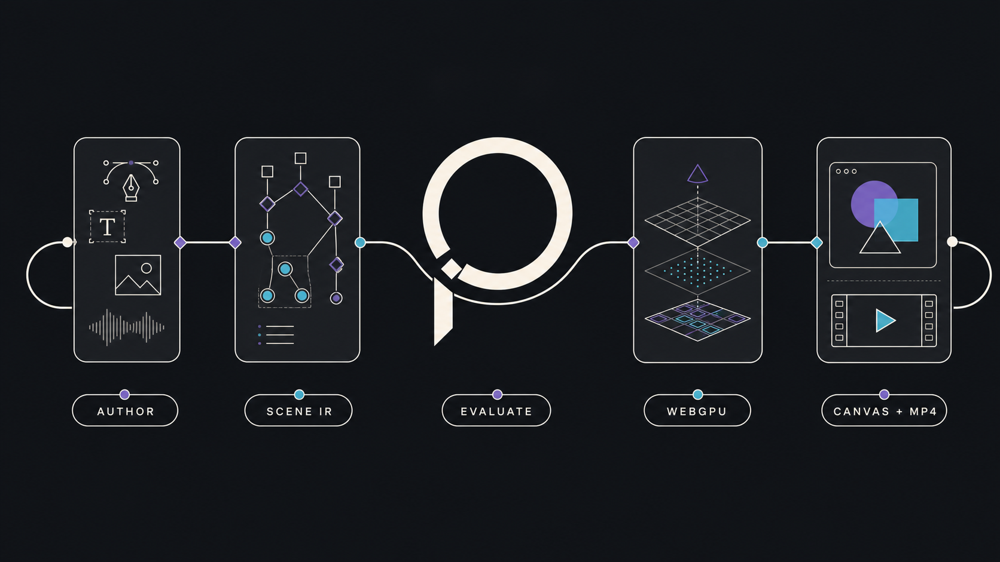

<p align="center">
  
</p>

<h1 align="center">Poietra</h1>

<p align="center">
  <strong>A browser-native motion graphics engine for programmable, expressive animation.</strong>
  <br />
  Author, preview, seek, and export motion through one deterministic scene runtime.
</p>

<p align="center">
  <a href="#vision">Vision</a> ·
  <a href="#architecture">Architecture</a> ·
  <a href="#what-works-today">Capabilities</a> ·
  <a href="#getting-started">Getting started</a> ·
  <a href="#project-status">Status</a>
</p>

---

## Vision

Poietra is building a new execution model for motion graphics: the immediacy of a
browser creative tool with the precision and composability of programmatic
animation.

Code-first animation systems can express complex ideas, but their creative loop
often ends in a render job: change source, execute it, wait for an artifact, and
inspect the result. Visual editors give immediate feedback, but rarely preserve the
semantic structure needed for mathematical, procedural, and reproducible motion.

Poietra brings those properties together. A validated Scene is retained in the
browser, sampled at any playhead position by the Rust engine, rendered through
WebGPU, and exported locally as MP4. The browser is not merely a preview client; for
Studio-native work, it is the primary motion runtime.

The long-term goal is simple to state:

> Make programmable motion directly manipulable without giving up its meaning.

### Why browser-native?

Browser-native rendering turns rendering from a remote batch operation into an
interactive primitive:

- edits, scrubbing, and playback can receive immediate local feedback;
- preview and final browser export share the same Scene evaluation semantics;
- Studio-native source and assets do not need to leave the device for rendering;
- compute scales with the creator's device instead of a central render queue; and
- a closed, resource-bounded Scene contract can be admitted without executing
  arbitrary generated Python or JavaScript in the client.

This is a deliberate primary path, not a claim that every workload belongs in a
browser. Very long, very large, or unsupported productions may still need a native
or server renderer. Poietra keeps the Scene contracts renderer-neutral for that
reason.

## Architecture

Poietra is not a port of Python or Manim into WebAssembly. It separates authoring,
animation semantics, frame evaluation, and drawing behind strict contracts:

<p align="center">
  
</p>

<details>
<summary>Text representation</summary>

```text
direct manipulation / structured edits / imported Manim
                         │
                         ▼
                 validated Scene IR
                         │
                 deterministic sampling
                         │
                         ▼
                   Render Packet
                    ╱          ╲
                   ▼            ▼
          WASM + WebGPU    native/headless WGPU
                   │
                   ▼
        interactive canvas / local MP4
```

</details>

The core boundaries are intentionally narrow:

- **Scene IR** stores explicit 2D geometry, animation channels, timing, camera,
  assets, materials, fidelity, and provenance.
- **The Rust evaluator** is the single implementation that samples a Scene at a
  requested time.
- **Render Packet** contains one fully sampled, ordered frame and no authoring or
  source-language semantics.
- **The WGPU renderer** validates and prepares complete frames before drawing.
- **The browser worker** retains the Scene, immutable assets, GPU state, and an
  `OffscreenCanvas`; normal frame requests return only bounded correlation data.

Unknown or unsupported meaning is never reconstructed from a bounding box, guessed
from source, or silently dropped. A failure rejects the affected Scene or export
with a structured reason. This truth-before-breadth rule is what allows preview,
interaction, and output to share one trustworthy runtime.

Read the complete contract and adoption decision in
[ADR 0002](docs/adr/0002-poietra-engine-ir-contracts.md), or start with the
[Engine overview](engine/README.md).

## Engine and Studio

This repository contains two closely related surfaces:

### Poietra Engine

The renderer-neutral Rust core. It owns Scene validation, deterministic frame
evaluation, cubic geometry, MathTex and Text outlines, WGPU preparation/rendering,
and the bounded WASM APIs used by browser preview and export.

### Poietra Studio

The reference authoring environment built with React. Studio demonstrates that the
engine can support a real creative loop: selection and direct manipulation,
timeline editing, an Inspector, structured operations, undo/redo, inline Text,
MathTex, fragment materials, and browser-native export.

Studio supports two explicit document origins:

- **Studio-native** documents are source-free. Their accepted edits and materialized
  Scene are authoritative, and MP4 export runs locally in the browser.
- **Imported Manim** documents preserve Python as the source authority. Poietra
  imports only semantics it can prove, provides bounded WebGPU preview and editing,
  and keeps source lowering and rendered validation explicit.

Natural-language assistance is an optional input to the same closed edit pipeline.
It does not emit privileged Python or bypass deterministic validation.

## What works today

| Area | Implemented vertical slice |
| --- | --- |
| Scene runtime | Strict versioned Scene/asset/frame contracts, f64 evaluation, retained Scene sessions, atomic snapshot replacement |
| Vector graphics | Closed cubic paths, concave and disjoint fills, holes and fill rules, general strokes, affine transforms, opacity, trim, morph, motion paths, and orthographic camera |
| Materials and assets | Solid paint, verified PNG images, immutable digest-keyed assets, built-in and project-local bounded fragment materials |
| Typography | Evidence-backed MathTex outlines plus bounded multiline Text with ASCII and a Japanese Noto Sans CJK JP subset |
| Browser runtime | Dedicated Worker, Rust/WASM evaluation, `OffscreenCanvas`, WebGPU drawing, device-loss recovery, exact frame correlation |
| Export | Local MP4 generation through the browser engine and WebCodecs, optional bounded WAV audio, progress, cancellation, and partial-output refusal |
| Studio authoring | Text, MathTex, Rectangle, Circle, Line, and Arrow creation; selection and multi-selection; move, resize, rotate, opacity, motion, lifetime, timeline, and material controls |
| Manim bridge | Conservative source discovery, verified Runtime Trace/snapshot profiles, bounded object selection and edits, `.py` export, reimport, and rendered validation |
| Evidence | Native/browser golden fixtures, WebGPU readbacks, Manim/Cairo visual parity, resource ceilings, payload measurements, and gesture/engine performance gates |

The renderer is deliberately not universal yet. Current contracts do not promise
arbitrary Python, arbitrary Manim plugins or TeX templates, complete font shaping,
3D/perspective, or every image, clipping, filtering, and compositing model. Generic
Manim support is promoted scene-by-scene and operation-by-operation only when the
complete import → preview → edit → export → reimport path has evidence.

See the current [generic importability scoreboard](docs/generic-importability-quality-gate.md)
and [MathTex source profile](docs/mathtex-source-profile.md) for the measured boundaries.

## Getting started

### Requirements

- Node.js 24 or newer
- pnpm 10
- Rust and `wasm-pack 0.15.0` for the first local launch, rebuilding the engine, or packaging Electron
- Chromium with WebGPU and WebCodecs for the complete browser path

### Run Studio in the browser

```sh
pnpm install --frozen-lockfile
pnpm dev:web
```

Open the loopback URL printed by Vite. A new Studio-native project can be created
from the workspace chooser without configuring Manim. The first launch builds any
missing canvas and MathTex WebAssembly artifacts before Vite starts.

### Run the desktop shell

```sh
pnpm dev:electron
```

Build the development Electron package with:

```sh
pnpm package:electron
pnpm test:electron-packaged
```

The packaged output is a development package, not a signed installer.

### Open an existing Manim project

Set the project root and command when they differ from this checkout and the
`manim` executable:

```sh
POIETRA_MANIM_PROJECT_ROOT=/path/to/project \
POIETRA_MANIM_COMMAND='["uv", "run", "manim"]' \
POIETRA_FAST_MANIM_RUNTIME_TRACE_DEV_OPT_IN=1 \
POIETRA_FAST_MANIM_RUNTIME_TRACE_COMMAND='["/path/to/fast-manim/.venv/bin/python", "-m", "manim.renderer.runtime_trace"]' \
pnpm dev:web
```

The Runtime Trace command supplies the canonical interactive preview for linked
Manim projects. Keep the explicit development opt-in: without a configured
producer, Studio lists the project but intentionally refuses preview-backed edits.
These two Runtime Trace variables may also be placed in the ignored `.env.local`;
Studio reads only its exact allowlisted non-secret configuration keys.

For Docker-backed rendering, the included adapter mounts the project read-only,
mounts only the preview directory as writable, and disables container networking:

```sh
POIETRA_MANIM_COMMAND='["node", "scripts/manim-docker-runner.mjs"]' pnpm dev:web
```

Imported source mutation requires explicit safe anchors. Unsupported overlap,
camera operations, unknown source identities, stale source digests, and failed
validation are refused rather than lowered approximately. The
[rendered validation pipeline](docs/rendered-validation-pipeline.md) documents the
current round trip.

### Optional Magic Edit

Magic Edit is disabled unless both an endpoint and a server-process credential are
configured:

```sh
VITE_POIETRA_AI_ENDPOINT=/api/ai/edit-suggestions \
OPENAI_API_KEY=... \
pnpm dev:web
```

The credential must be injected into the actual server process and must never use a
`VITE_` variable. Editor context is sent to the configured provider only when this
feature is enabled. See the [interaction memo](docs/edit-operation-model.md) for the
closed suggestion and validation model.

## Verification

Common repository gates:

```sh
pnpm check:style
pnpm test
pnpm check:web
pnpm test:e2e
pnpm test:e2e:visual-parity
pnpm test:engine:wasm-smoke
pnpm test:mathtex:wasm-smoke
pnpm test:importer:quality
```

Engine-only checks:

```sh
cargo fmt --all --manifest-path engine/Cargo.toml -- --check
cargo test --locked --workspace --manifest-path engine/Cargo.toml
cargo clippy --locked --workspace --all-targets --all-features \
  --manifest-path engine/Cargo.toml -- -D warnings
```

Real Manim and production sandbox conformance remain explicit opt-in gates because
they depend on external runtimes and host isolation. The full command catalog lives
in [`package.json`](package.json), and suite ownership is documented in the
[testing strategy](docs/testing-strategy.md).

## Repository map

| Path | Responsibility |
| --- | --- |
| [`engine/`](engine/) | Rust Scene contracts, evaluator, geometry, WGPU renderer, MathTex/Text compilers, and WASM/native boundaries |
| [`src/`](src/) | React Studio, browser workers, authoring state, engine adapters, export, and client contracts |
| [`server/`](server/) | Local/imported-Manim integration, render/snapshot boundaries, and production adapters |
| [`fixtures/`](fixtures/) | Cross-runtime semantic, raster, parity, importability, and source-profile evidence |
| [`docs/`](docs/) | Architecture decisions, runbooks, quality gates, and performance evidence |
| [`e2e/`](e2e/) | Browser, WebGPU, interaction, packaging, and visual-parity scenarios |
| [`scripts/`](scripts/) | Builds, smoke tests, fixture generation, benchmarks, and evidence promotion |

## Design documents

- [Engine IR and renderer contracts](docs/adr/0002-poietra-engine-ir-contracts.md)
- [Runtime Trace digest and streaming](docs/adr/0003-runtime-trace-canonical-digest-streaming.md)
- [Scene Edit and runtime ownership](docs/adr/0004-studio-edit-ownership-and-runtime-application.md)
- [Studio state and operation model](docs/studio-state-operation-model.md)
- [Direct-manipulation findings](docs/edit-operation-model.md)
- [Browser/native visual and performance evidence](engine/README.md)
- [Production render sandbox](docs/production-render-sandbox.md)

Historical shell-selection work, including the Tauri/Electron comparison that led
to the current Electron path, remains available in
[the shell evaluation ADR](docs/shell-evaluation.md). It is project history, not the
identity of Poietra.

## Project status

Poietra is under active development. The Engine and Studio vertical slices are
implemented and extensively tested, but the public Scene ABI, authoring API, and
document formats are not yet declared stable. Capability claims in this repository
are intentionally bounded by executable evidence; unsupported inputs fail
explicitly instead of receiving a best-effort rendering.
